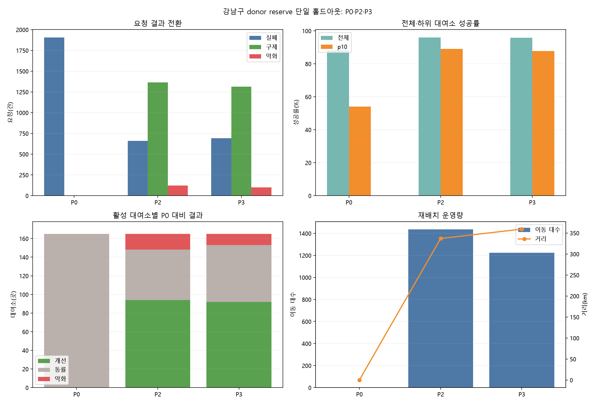
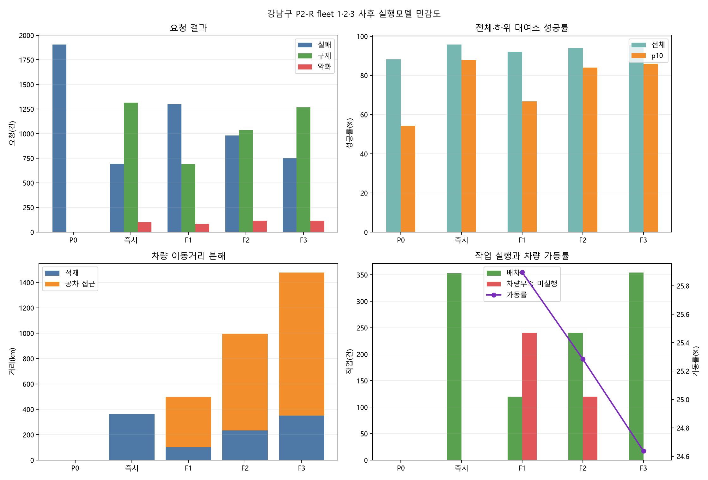
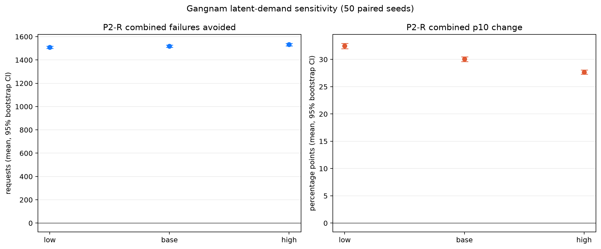
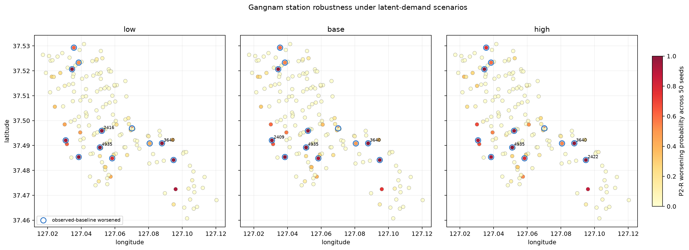

# 따릉이 재배치 정책 시뮬레이터

서울시 공공자전거 따릉이의 품절을 줄이면서도, 공급 대여소의 이용자를 과도하게 희생하지
않는 재배치 정책을 찾는 데이터 분석 프로젝트입니다. 2025년 11월 강남구 대여·재고 이력을
이벤트 단위로 재생하고, 정책별 서비스·형평성·운영량의 trade-off를 검증합니다.

현재 단계는 **M18: 잠재수요 대여소 공간 강건성 완료**입니다.



## 핵심 질문과 결론

재배치가 필요한 수요처만 보면 공급 대여소에서 자전거를 많이 가져올수록 유리합니다. 하지만
그 결과 원래 성공했을 공급지 이용자가 실패할 수 있습니다. 그래서 공급지에 반드시 남길 최소
재고인 `donor reserve`를 정책 변수로 두었습니다.

학습기간 Pareto 분석에서 서비스 우선 `reserve 5`와 요청 보호를 강화한 `reserve 7` 사이의
절충을 확인한 뒤, **결과를 보기 전에 reserve 7을 동결**하고 11월 24~28일 홀드아웃을 한 번만
실행했습니다.

| 정책 | 성공률 | 실패 | P0 성공→정책 실패 | 대여소 p10 | P0보다 악화된 대여소 | 이동 대수 | 거리 |
|---|---:|---:|---:|---:|---:|---:|---:|
| P0 재배치 없음 | 88.24% | 1,905건 | 0건 | 54.07% | 0곳 | 0대 | 0.0km |
| P2 서비스형, reserve 5 | 95.92% | 661건 | 122건 | 89.09% | 17곳 | 1,435대 | 336.8km |
| **보호형 P2-R, reserve 7** | **95.74%** | **691건** | **100건** | **87.80%** | **12곳** | **1,224대** | **359.2km** |

P2-R은 P2보다 전체 실패가 30건 늘고 p10이 1.286%p 낮아졌습니다. 반면 P0에서는 성공했지만
정책 때문에 실패한 요청을 22건 줄였고, 악화 대여소도 17곳에서 12곳으로 줄였습니다. 이동
대수는 211대 감소했으나 더 먼 공급지를 이용해 총 거리는 22.4km 늘었습니다.

따라서 이 프로젝트의 결론은 “reserve 7이 무조건 최적”이 아닙니다. **전체 서비스 30건과
개별 이용자 악화 22건 사이에서 공급지 보호를 택한 운영안**이며, 데이터만으로 없앨 수 없는
가치 판단을 수치로 드러낸 결과입니다.

상세 결과는 [단일 홀드아웃 보고서](reports/gangnam_2025_11_donor_reserve_holdout.md)에서
확인할 수 있습니다.

### 차량 접근을 넣으면 얼마나 달라지는가

기존 P2-R은 차량이 각 공급지에서 즉시 출발하는 낙관 참조입니다. 차량 1·2·3대가 합성
greedy-medoids 거점에서 출발하고 배송 완료 위치를 이어 쓰도록 바꾸면 다음 범위가 나옵니다.

| 실행모델 | 성공률 | 실패 | P0 대비 실패 방지 | 총거리 | 공차 접근 비중 | 차량부족 미실행 |
|---|---:|---:|---:|---:|---:|---:|
| 즉시출발 P2-R | 95.74% | 691건 | 1,214건 | 359.2km | 0.0% | 0건 |
| 합성 fleet 1 | 91.98% | 1,299건 | 606건 | 496.5km | 79.6% | 240건 |
| 합성 fleet 2 | 93.94% | 982건 | 923건 | 994.9km | 76.6% | 120건 |
| 합성 fleet 3 | 95.37% | 751건 | 1,154건 | 1,477.0km | 76.3% | 0건 |

fleet 3도 즉시출발보다 실패가 60건 늘고 총거리는 4.11배입니다. fleet 수가 늘수록 서비스는
회복되지만 이동거리도 증가합니다. 실제 차량 수·차고지 자료가 없으므로 3대를 정답으로 고르지
않고 **실행 현실성에 따른 성능 범위**로만 해석합니다.



### 품절로 사라진 요청을 넣어도 정책 방향이 유지되는가

시간별 재고가 0대인 구간의 직접 미충족수요를 Poisson 요청으로 합성하고, 사전 동결한 50개
seed에서 P0와 P2-R이 매번 같은 요청 manifest를 보도록 paired 비교했습니다.

| 수준 | 합성요청 평균 | P2-R combined 실패 방지 | 기존 관측요청 실패 방지 | combined p10 변화 | 악화 대여소 평균 |
|---|---:|---:|---:|---:|---:|
| low | 1,368건 | 1,509건 | 934건 | +32.47%p | 16.3곳 |
| base | 1,645건 | 1,518건 | 899건 | +30.06%p | 17.2곳 |
| high | 1,922건 | 1,532건 | 882건 | +27.68%p | 18.0곳 |

세 수준 모두 P2-R의 실패 감소와 p10 개선 방향이 유지됐고, backoff·상한·합성비중을 포함한
7개 사전 중단조건도 모두 통과했습니다. 다만 잠재요청이 늘수록 기존 관측요청의 실패 방지는
줄고 악화 대여소는 늘어, **전체 서비스 개선과 기존 이용자 재고 경쟁이 함께 커지는 현상**이
확인됩니다. 이는 실제 미충족수요 복원이 아니라 사후 민감도 범위입니다.



대여소별로 보면 low/base/high에서 persistent 악화는 각각 8곳이며, 다음 7곳은 세 수준 모두
50개 seed의 80% 이상에서 반복 악화됐습니다: `2305`, `2409`, `2416`, `2422`, `3609`,
`3640`, `4935`. high 수준에서 `3640 일원1동주민센터앞 사거리`는 50/50 seed에서 악화되고
P2-R 실패가 평균 10.46건 더 많았습니다. 관측 기준에서는 악화되지 않았지만 high에서 새로
persistent가 된 곳은 `2387 래미안강남힐즈 사거리` 한 곳입니다.

파란 테두리는 관측 전용 기준의 12개 악화 대여소, 색은 50개 seed의 악화 확률입니다. 이는
인구 형평성 지도가 아니라 **재배치 정책의 공간적 서비스 안정성 지도**입니다.



## 데이터와 실험 범위

- 서울 전체 2025년 11월 대여이력 3,186,968행을 스트리밍 처리
- 강남구 출발 또는 도착 이동 137,463건만 정제
- 자전거번호·생년·성별·이용자종류는 저장하지 않음
- 분석 후보 167개 대여소 중 좌표가 확인된 165개를 모든 공간 정책에 공통 적용
- 학습기간: 2025-11-03 00:00 이상, 2025-11-22 00:00 미만
- 홀드아웃: 2025-11-24 00:00 이상, 2025-11-29 00:00 미만
- 최종 홀드아웃 관측 요청: 16,205건


## 시뮬레이터가 반영하는 것

- 동일 초기 재고와 동일 요청 순서에서 P0·P1·P2-S·P2-R을 결정론적으로 비교
- 대여 성공/실패, 내부 반납, 강남구 외부 유입·유출 이벤트를 시간순으로 처리
- 실패한 대여의 후속 반납을 억제해 존재하지 않는 자전거가 생기지 않도록 처리
- Haversine 거리, 도로거리 보정, 평균속도, 상하차 시간에 따른 재배치 지연 도착
- 시간당 작업 수, 차량 적재량, 이동 대수 상한 적용
- 요청별 구제·악화 trace와 대여소별 개선·악화 분포 산출
- 사용자 이동 중·재배치 중 자전거까지 포함한 보존식 검증
- 선택적 fleet 실행에서 차량 접근·픽업 시점 재고·busy 상태·연속 배송 위치 반영
- 선택적 잠재수요 manifest의 해시 검증과 관측·합성·combined side-car 지표

주요 구현은 [simulation.py](src/ddareungi_rearrangement/simulation.py)와
[latent_sensitivity.py](src/ddareungi_rearrangement/latent_sensitivity.py), 실행 인터페이스는
[cli.py](src/ddareungi_rearrangement/cli.py)에서 확인할 수 있습니다.

## 분석 단계별 결과

| 분석 | 확인한 내용 | 보고서 |
|---|---|---|
| 데이터 감사 | 재고·대여이력·대여소 메타데이터의 분석 가능 범위와 경고 | [과거 데이터 감사](reports/historical_data_audit.md) |
| 강남구 기준선 | 품절 시간대, 대여소 순유입, 대여 흐름 | [기준선 EDA](reports/gangnam_2025_11_baseline.md) |
| P0/P1 재생 | 고정 임계값 정책의 낙관적 상한 | [기본 시뮬레이션](reports/gangnam_2025_11_simulation.md) |
| P0/P1/P2 | 거리·시간 지연이 있는 greedy-nearest 비교 | [공간 시뮬레이션](reports/gangnam_2025_11_spatial_simulation.md) |
| 운영 민감도 | 작업 1~3회, 속도 10~20km/h, 적재 10·20대 18개 조합 | [민감도 분석](reports/gangnam_2025_11_p2_sensitivity.md) |
| 시간 강건성 | 30일 모두 P2가 P0보다 개선되는지 날짜별 확인 | [일별 강건성](reports/gangnam_2025_11_daily_robustness.md) |
| 공간 형평성 | 개선·동률·악화 대여소와 p10 서비스율 | [대여소 형평성](reports/gangnam_2025_11_station_equity.md) |
| 요청 피해 | P0 성공에서 정책 실패로 바뀐 요청과 선행 유출 추적 | [요청 trace](reports/gangnam_2025_11_harm_trace.md) |
| 공급지 보호 학습 | reserve 5·6·7·8의 비가중 Pareto 비교 | [reserve 학습](reports/gangnam_2025_11_donor_reserve_training.md) |
| 공급지 보호 검증 | 동결한 reserve 7과 기존 reserve 5의 단일 홀드아웃 | [reserve 홀드아웃](reports/gangnam_2025_11_donor_reserve_holdout.md) |
| 차량 실행 민감도 | 즉시출발과 합성 fleet 1·2·3의 서비스·공차거리 범위 | [fleet 민감도](reports/gangnam_2025_11_fleet_sensitivity.md) |
| 잠재수요 manifest·통합 | 검열시간·Poisson 강도·hash·출처별 보존식 계약 | [잠재수요 생성 계약](docs/LATENT_DEMAND_CONTRACT.md) |
| 잠재수요 정책 민감도 | 50개 seed에서 P0·P2-R 방향과 중단조건 검증 | [잠재수요 결과](reports/gangnam_2025_11_latent_sensitivity.md) |
| 잠재수요 공간 강건성 | 반복·간헐·새 악화 대여소와 50-seed 악화 확률 | [같은 잠재수요 결과의 공간 강건성](reports/gangnam_2025_11_latent_sensitivity.md#대여소-공간-강건성) |

기존 결과 파일은 보호형 정책을 P3라고 표기했지만, 초기 계획의 `Forecast + min-cost flow`
P3와 충돌해 이후 명칭을 `P2-R`로 정리했습니다. 자세한 경계는
[차량 실행모델 계약](docs/VEHICLE_ROUTING_CONTRACT.md)에 기록했습니다.

## 재현 방법

### 1. 개발환경

- Python 3.11
- `uv` 패키지·가상환경 관리
- Polars, PyArrow, DuckDB, Matplotlib
- pytest, Ruff

```powershell
git clone https://github.com/jinjerry0927/ddareungi-rearrangement.git
Set-Location ddareungi-rearrangement
uv sync
uv run ddareungi doctor
```

### 2. 원천 데이터

대용량 원천·처리 데이터는 Git에 포함하지 않습니다. 공식 페이지에서 받은 파일을 다음 위치에
준비해야 전체 분석을 재현할 수 있습니다.

- `data/raw/stations_2025_12.xlsx`
- `data/raw/inventory_2025_q4.zip`
- `data/raw/rental_history_2025.zip`

실시간 API 감사와 좌표 스냅샷에는 서울 열린데이터광장 인증키가 필요합니다.

```powershell
Copy-Item -LiteralPath '.env.example' -Destination '.env'
```

```dotenv
SEOUL_OPEN_DATA_API_KEY=발급받은_인증키
```

`.env`는 Git에서 제외됩니다. 인증키를 커밋하거나 보고서에 기록하지 않습니다.

### 3. 분석 파이프라인

```powershell
uv run ddareungi audit-historical-data
uv run ddareungi build-pilot
uv run ddareungi run-simulation
uv run ddareungi snapshot-coordinates
uv run ddareungi run-spatial-simulation
uv run ddareungi run-sensitivity
uv run ddareungi run-temporal-robustness
uv run ddareungi run-station-equity
uv run ddareungi run-harm-trace
uv run ddareungi run-donor-reserve-training
uv run ddareungi run-donor-reserve-holdout
uv run ddareungi run-fleet-sensitivity
uv run ddareungi run-latent-demand-sensitivity
```

전체 코드 품질·회귀 테스트·환경 진단은 한 번에 실행할 수 있습니다.

```powershell
.\scripts\verify.ps1
```

현재 검증 기준은 Ruff lint·format, pytest **45개**, Python·필수 디렉터리·API 키 설정 확인
통과입니다. 분석 명령은 기본 경로 대신 각 입력·출력 경로를 CLI 옵션으로 바꿀 수 있습니다.

## 해석할 때 지켜야 할 한계

- 공개 대여이력에는 성공한 요청만 있어, 품절 때문에 시도하지 못한 잠재 수요는 빠져 있습니다.
- 잠재수요 결과는 50개 생성 seed의 변동만 포함하며 실제 미충족수요나 전체 모형 불확실성을
  복원한 값이 아닙니다.
- 공식 거치대 수보다 재고가 많은 관측이 빈번해 만차·반납 실패는 아직 모델링하지 않습니다.
- 좌표는 현재 API 스냅샷이라 2025년 운영 당시 위치와 다를 수 있습니다.
- 핵심 P2-R 결과는 공급지 즉시출발이며, fleet 민감도만 합성 접근·연속 위치를 반영합니다.
- fleet 수·초기 거점은 공식 운영정보가 아니며 실제 교통·차고지·교대는 미반영입니다.
- 일별 비교는 실제 자정 재고로 매일 초기화해 월 연속 무재배치와 계약이 다릅니다.
- 서비스 P2 운영능력과 형평성도 같은 5일 홀드아웃에서 분석돼 완전히 독립된 검증이 아닙니다.
- 대여소별 서비스율은 운영 형평성 대리변수이며 인구·소득·교통약자를 직접 나타내지 않습니다.

이 결과는 현장 효과의 확정치가 아니라, **정책 가정이 같은 관측수요 재생 안에서 어떤 요청과
대여소에 이익·피해를 옮기는지 비교하는 의사결정 실험**입니다.

## 프로젝트 문서

- [전체 프로젝트 계획](docs/PROJECT_PLAN.md)
- [현재 상태와 검증 기록](docs/STATE.md)
- [차량 접근·연속 경로 구현 계약](docs/VEHICLE_ROUTING_CONTRACT.md)
- [자율 실행 루프와 중단 규칙](LOOP.md)

## 데이터 출처

- [서울시 공공자전거 따릉이 대여이력 정보](https://data.seoul.go.kr/dataList/OA-15182/A/1/datasetView.do)
- [서울시 대여소별 공공자전거 따릉이 대여가능 수량](https://data.seoul.go.kr/dataList/OA-22382/F/1/datasetView.do)
- [서울시 공공자전거 따릉이 대여소 정보](https://data.seoul.go.kr/dataList/OA-13252/F/1/datasetView.do)
- [서울시 공공자전거 따릉이 실시간 대여정보](https://data.seoul.go.kr/dataList/OA-15493/A/1/datasetView.do)
