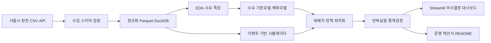

# 따릉이 재배치 분석 프로젝트 계획서

- 프로젝트명: **BikeBalance Seoul**
- 문서 버전: 1.0
- 작성일: 2026-08-19
- 현재 상태: M2 관측수요 재생 P0/P1 정책 비교 완료
- 예상 기간: 주 8~12시간 기준 7~8주
- 프로젝트 성격: 데이터 분석 + 수요예측 + 이산사건 시뮬레이션 + 운영 최적화 + 의사결정 대시보드

## 1. 결정 요약

### 주 작업환경

**VS Code를 주 작업환경으로 사용한다.** VS Code 안에서 Python 코드, Jupyter Notebook, 테스트, Git, Streamlit 대시보드를 모두 관리한다. Colab은 선택적인 공유·일회성 실험 환경으로만 사용한다.

시뮬레이터가 VS Code에서만 동작하는 것은 아니다. 시뮬레이터는 Python 프로그램이며 VS Code와 Colab은 실행·편집 환경이다. 이 프로젝트에서는 대용량 파일, 반복 실험, 모듈화, 테스트, Git 이력, 로컬 대시보드가 중요하므로 지속적인 로컬 환경이 더 적합하다.

### 핵심 문제

> 재배치 차량과 운영시간이 제한된 상황에서, 어떤 대여소에서 언제 몇 대의 자전거를 옮겨야 대여 실패와 반납 불편을 가장 경제적으로 줄일 수 있는가?

### v1 범위

- 데이터 품질이 좋은 자치구 1개
- 활성 대여소 약 50~100개
- 학습·보정 8주, 최종 검증 2주
- 재배치 차량 1~3대
- 운영정책 4개 비교
- 실제 대여이력과 재고 스냅샷으로 보정한 이벤트 기반 시뮬레이터
- 비용·서비스·지역 형평성을 함께 보여주는 웹 대시보드

### v1의 최종 결과

운영자가 차량 수, 차량 용량, 정책, 의사결정 주기를 바꾸고 다음 결과를 비교할 수 있어야 한다.

- 대여 실패율
- 반납 시 재지정 또는 실패율
- 재배치 거리와 작업량
- 실패 1건 감소당 운영비용
- 최악 대여소의 서비스 수준
- 수요 급증과 예측 오차에 대한 안정성

## 2. VS Code와 Colab 선택

| 기준 | VS Code + 로컬 Python | Google Colab | 프로젝트 결정 |
|---|---|---|---|
| 대용량 원천 데이터 | 로컬 디스크와 DuckDB로 반복 조회하기 편함 | 업로드·Drive I/O와 세션 저장을 관리해야 함 | VS Code |
| 실행환경 지속성 | 가상환경과 캐시를 그대로 유지 | 유휴 상태와 최대 수명에 따라 VM이 삭제될 수 있음 | VS Code |
| 코드 모듈화 | `src/`, 테스트, CLI, 앱 구성이 쉬움 | 노트북 중심이면 코드가 셀에 분산되기 쉬움 | VS Code |
| 테스트·Git | `pytest`, lint, commit 단위 관리가 자연스러움 | 가능하지만 주 작업 흐름으로는 번거로움 | VS Code |
| 탐색적 분석 | VS Code Jupyter로 가능 | 매우 편리함 | 둘 다 가능 |
| 공유 | 저장소·배포 링크 필요 | 노트북 링크 공유가 쉬움 | Colab 보조 |
| GPU | 필요 시 별도 구성 | 접근이 쉬우나 할당이 보장되지 않음 | 이 프로젝트는 GPU 불필요 |
| AI 보조 | Codex와 로컬 코드베이스를 함께 다루기 좋음 | Colab AI의 노트북 분석이 편리함 | 편의보다 재현성을 우선 |

VS Code는 Python 및 Jupyter 확장을 통해 로컬 가상환경의 커널을 선택해 Notebook을 실행할 수 있다. Colab은 공유에 유리하지만 공식 FAQ상 VM은 유휴 상태가 지속되면 삭제되며, 사용 제한과 최대 수명은 동적으로 달라질 수 있다.

### Colab을 사용할 조건

- 다른 사람에게 EDA 결과를 Notebook 한 개로 공유할 때
- 로컬 PC의 메모리·디스크가 부족해 축약 데이터로 실험할 때
- 최종 포트폴리오에 `Open in Colab` 형태의 읽기 쉬운 데모를 추가할 때

Colab Notebook을 만들더라도 핵심 로직을 셀에 복사하지 않는다. 설치 후 `src/` 패키지를 가져와 실행하는 얇은 데모 Notebook으로 유지한다.

## 3. 프로젝트 목적과 이해관계자

### 대상 사용자

- 따릉이 재배치 운영 담당자라는 가상의 의사결정자
- 데이터 분석·데이터 사이언스·운영 최적화 직무의 채용 담당자
- 정책별 결과를 직접 비교하려는 포트폴리오 방문자

### 첫 번째 성공 경험

사용자가 기준 기간과 차량 수를 선택하고 `시뮬레이션 실행`을 누른 뒤, 현행에 가까운 기준정책과 개선정책의 서비스 수준·비용·형평성 차이를 지도와 표에서 확인한다.

### 성공 기준

1. 실제 데이터에서 반복적으로 품절·만차 위험이 높은 시간과 대여소를 식별한다.
2. 시뮬레이터가 자전거 총량과 모든 용량 제약을 항상 지킨다.
3. 동일한 수요 표본을 사용해 정책들을 공정하게 비교한다.
4. 예측모델이 단순 기준모델보다 낫지 않다면 단순 모델을 채택한다.
5. 운영 권고안은 효과 크기, 신뢰구간, 비용, 최악 지역의 변화를 포함한다.
6. Git 저장소를 새 환경에서 재현할 수 있다.

### 비목표

- 서울 전체를 처음부터 최적화하지 않는다.
- 실제 서울시 운영시스템과 연동하거나 자동으로 재배치 명령을 전송하지 않는다.
- 강화학습을 v1에 넣지 않는다.
- 실제 재배치 차량의 정확한 교통상황과 근무 규정을 모두 재현하지 않는다.
- 시뮬레이션 결과를 실제 현장 인과효과로 단정하지 않는다.
- 화려한 딥러닝 모델 자체를 목표로 삼지 않는다.

## 4. 연구 질문과 가설

### 주 연구 질문

차량 수와 이동거리 제약 아래에서 어떤 재배치 정책이 서비스 실패를 가장 효율적으로 줄이는가?

### 부 연구 질문

- 차량을 추가할 때 서비스 개선의 한계효용은 어디에서 급격히 줄어드는가?
- 예측 정확도가 좋아지면 실제 운영성과도 같은 비율로 좋아지는가?
- 전체 평균을 최적화할 때 특정 대여소가 더 나빠지는가?
- 비·출퇴근 수요 급증·예측 오차에도 같은 정책이 우수한가?
- 정교한 최적화가 단순 임계치 정책보다 운영 복잡성을 감수할 만큼 나은가?

### 사전 가설

- H1: 고정 순회보다 재고 임계치 기반 정책이 서비스 실패를 줄인다.
- H2: 예측 기반 정책은 같은 이동거리에서 임계치 정책보다 실패를 줄인다.
- H3: 차량 수가 늘수록 개선폭은 체감한다.
- H4: 평균 실패만 최소화하면 하위 대여소의 서비스 격차가 커질 수 있다.

가설은 결과가 아니며 분석 전에 기록한 검증 대상이다.

## 5. 데이터 계획

### 필수 데이터

| 데이터 | 용도 | 상태 |
|---|---|---|
| 따릉이 대여이력 | 대여·반납 요청, OD 흐름, 시간대별 수요 | 서울 열린데이터광장 제공 |
| 실시간 대여정보 | 대여소별 현재 재고·거치 상태 수집 | 서울 열린데이터광장 API 제공 |
| 대여소 정보 | 대여소 ID, 이름, 위도·경도, 용량 | API·연관 데이터에서 확인 |
| 과거 재고 스냅샷 | 시뮬레이터 보정, 품절·만차 구간 확인 | M0에서 가용기간·품질 확인 |

### 선택 데이터

- 기온, 강수, 풍속 등 날씨
- 공휴일과 요일
- 문화행사 또는 특이 수요일
- 도로망 또는 대여소 간 추정 이동시간

날씨는 v1 후반의 수요예측 개선 변수다. 날씨 연동 때문에 핵심 시뮬레이터 구현을 지연시키지 않는다.

### M0 데이터 통과 기준

선택 자치구는 다음을 만족해야 한다.

- 분석기간에 활성 대여소 50개 이상
- 대여소 ID 매핑 성공률 95% 이상
- 용량 또는 거치 가능 수량 확보율 90% 이상
- 선택기간 재고 스냅샷 커버리지 90% 이상
- 타임스탬프가 동일 시간대로 정규화 가능
- 대여·반납 대여소가 삭제·이전 대여소와 구분 가능

조건을 만족하는 자치구가 없으면 범위를 30개 대여소로 축소하거나 실시간 API를 2주 이상 직접 수집한 뒤 진행한다. 누락값을 임의로 채워 실제 데이터처럼 사용하지 않는다.

### 중요한 데이터 한계

#### 관측되지 않은 잠재 수요

대여이력에는 실제로 완료된 대여만 존재한다. 자전거가 없어 시도조차 못 한 수요는 기록되지 않는다. 따라서 결과를 두 계층으로 구분한다.

1. **관측수요 재생 시나리오:** 실제 완료된 요청만 재생하는 보수적 분석
2. **잠재수요 확장 시나리오:** 품절시간·인근 대여소 이동·시간대 수요를 이용해 미관측 수요를 추정한 분석

두 번째 결과는 관측값이 아니라 모델 추정값으로 표시하고, 낮음·기준·높음 세 수준의 민감도 범위를 제공한다.

#### 실제 재배치 이력 부재 가능성

공개 데이터에 차량별 재배치 기록이 없다면 재고 스냅샷과 대여·반납 흐름의 잔차로 재배치량을 추정한다. 추정 재배치는 `inferred`로 표시하고 실제 운영기록이라고 표현하지 않는다.

## 6. v1 시스템 구성



### 권장 기술 스택

- Python 3.12
- VS Code + Python 확장 + Jupyter 확장
- `uv` 또는 표준 가상환경과 `pyproject.toml`
- DuckDB: 대용량 CSV·Parquet 조회
- Polars 또는 Pandas: 데이터 정제와 분석
- scikit-learn: 기준 수요모델과 예측모델
- OR-Tools: 최소비용 흐름과 차량경로 최적화
- Plotly + Streamlit: 지도·그래프·정책 비교 UI
- pytest: 시뮬레이터 불변조건과 통합 테스트
- Ruff: 코드 품질 검사

### 시뮬레이션 엔진 결정

v1은 **Python 이벤트 우선순위 큐를 이용한 자체 이벤트 엔진**으로 시작한다. 대여·반납·재배치 픽업·도착의 규칙을 명시적으로 테스트하기 쉽기 때문이다. SimPy는 여러 차량의 근무교대·충전·작업자 대기열 같은 자원 경쟁이 필요해질 때 후속 버전에서 검토한다.

정책은 30분마다 의사결정을 내리되, 대여와 반납 이벤트는 원본 타임스탬프 순서로 처리한다.

### 데이터 계약

#### Station

- `station_id`
- `station_name`
- `latitude`, `longitude`
- `capacity`
- `district`
- `active_from`, `active_to`

#### TripRequest

- `request_id`
- `rental_at`, `return_at`
- `origin_station_id`, `destination_station_id`
- `duration_minutes`
- `source`: `observed` 또는 `synthetic_latent`

#### StationState

- `timestamp`
- `station_id`
- `available_bikes`
- `available_racks`
- `capacity`

#### RelocationAction

- `decided_at`
- `vehicle_id`
- `from_station_id`, `to_station_id`
- `bike_count`
- `depart_at`, `arrive_at`
- `distance_km`
- `policy_name`
- `source`: `observed`, `inferred`, `simulated`

#### SimulationResult

- 정책과 랜덤 시드
- 요청·성공·실패·재지정 건수
- 대여소별 서비스 수준
- 차량 이동거리·작업시간·이동 자전거 수
- 비용과 제약 위반 여부

### 권장 저장소 구조

```text
bike-balance-seoul/
├─ pyproject.toml
├─ README.md
├─ .env.example
├─ configs/
│  ├─ data.yaml
│  └─ experiments/
├─ data/
│  ├─ raw/          # Git 제외
│  ├─ interim/      # Git 제외
│  ├─ processed/    # 대용량 결과 Git 제외
│  └─ sample/       # 재현용 소형 익명 샘플만 추적
├─ notebooks/
│  ├─ 01_data_audit.ipynb
│  ├─ 02_eda.ipynb
│  └─ 03_policy_results.ipynb
├─ src/bike_balance/
│  ├─ ingest/
│  ├─ features/
│  ├─ forecasting/
│  ├─ simulation/
│  ├─ policies/
│  ├─ optimization/
│  └─ evaluation/
├─ app/
├─ tests/
├─ reports/
└─ scripts/
```

Notebook은 탐색과 설명에 사용하고, 재사용되는 정제·모델·시뮬레이션 코드는 반드시 `src/`로 이동한다.

## 7. 시뮬레이션 규칙

### 이벤트 종류

- 대여 요청
- 반납 도착
- 재배치 차량 출발
- 자전거 픽업
- 재배치 차량 도착
- 자전거 하차
- 정책 의사결정 시점

### 기본 처리 규칙

1. 대여 요청 시 자전거가 있으면 재고를 1 감소시키고 반납 이벤트를 예약한다.
2. 자전거가 없으면 `unmet_rental`로 기록하며 해당 요청의 반납 이벤트는 만들지 않는다.
3. 목적지가 만차이면 정해진 반경 내 가장 가까운 여유 대여소로 재지정하고 추가 이동을 기록한다.
4. 재지정 가능한 곳이 없으면 `failed_return`으로 기록한다.
5. 재배치 픽업은 대여소 재고와 차량 적재용량을 초과할 수 없다.
6. 재배치 하차는 대여소의 빈 거치대를 초과할 수 없다.
7. 자전거 총량은 대여소 재고, 운행 중 사용자 자전거, 차량 적재 자전거를 합산해 항상 보존되어야 한다.

### 이동시간

v1에서는 대여소 좌표의 직선거리에 보정계수를 적용하고 평균 차량속도로 이동시간을 계산한다. 이후 필요할 때 도로망 기반 이동시간으로 교체할 수 있도록 `TravelTimeProvider` 인터페이스를 분리한다.

### 비교 정책

| 코드 | 정책 | 설명 | v1 포함 |
|---|---|---|---|
| P0 | No relocation | 재배치하지 않는 하한 기준 | 필수 |
| P1 | Static threshold | 고정 시간에 재고 상·하한 기준으로 순회 | 필수 |
| P2 | Greedy nearest | 가까운 과잉 대여소에서 부족 대여소로 이동 | 필수 |
| P3 | Forecast + min-cost flow | 향후 수요를 예측하고 이동비용과 부족비용을 함께 최소화 | 필수 |
| P4 | Forecast + VRP | 실제 차량 순회 경로까지 통합 최적화 | 확장 목표 |

P4가 일정에 부담을 주면 v1 완료를 위해 제외한다. P0~P3만으로도 운영정책 비교가 성립해야 한다.

### 목적함수

정책은 다음 비용의 가중합을 최소화한다.

```text
총비용 =
  대여 실패 비용
+ 반납 재지정·실패 비용
+ 재배치 차량 거리 비용
+ 자전거 상하차 작업 비용
+ 최악 대여소 서비스 격차 패널티
```

가중치는 임의의 단일 숫자로 고정하지 않는다. 운영비 중심, 서비스 중심, 형평성 중심의 세 시나리오로 민감도 분석한다.

## 8. 수요예측 계획

### 모델 순서

1. 같은 요일·같은 시간대의 과거 평균
2. 최근 이동평균
3. 시간·요일·공휴일·날씨를 사용하는 단순 회귀 또는 트리 모델
4. 필요할 때 수요 분포를 위한 count model 또는 quantile model

### 선택 규칙

- 시간 순서 기반 학습·검증·테스트 분할을 사용한다.
- 최종 검증기간은 모델·정책 튜닝에 사용하지 않는다.
- 예측모델이 seasonal naive보다 주 지표를 5% 이상 개선하지 못하면 단순 기준모델을 채택한다.
- 예측 성능과 운영성과를 별도로 보고한다. RMSE가 낮아도 서비스 실패를 줄이지 못할 수 있다.
- 미래 대여·반납 정보가 특징에 섞이지 않도록 leakage 테스트를 둔다.

## 9. 평가 지표

### 1차 KPI

- 요청 1,000건당 서비스 실패 건수
  - 대여 실패
  - 반납 실패
  - 반납 재지정은 별도 집계

### 운영비 지표

- 재배치 총거리
- 차량별 작업시간
- 이동한 자전거 수
- 픽업·하차 횟수
- 실패 1건 감소당 추정 운영비

### 서비스 지표

- 대여 성공률
- 최초 목적지 반납 성공률
- 품절·만차 상태 지속시간
- 대여소가 목표 재고구간에 머문 시간 비율
- 평균, p95, 최악 10% 대여소 결과

### 형평성 지표

- 대여소별 실패율의 분산과 최악값
- 정책 도입 전후 하위 10% 대여소의 변화
- 특정 생활권의 개선을 위해 다른 생활권이 악화되는지 여부

### 모델 충실도

- 관측 재고와 시뮬레이션 재고의 MAE
- 대여소·시간대별 수요 MAE
- 관측 품절시간과 재현 품절시간 차이
- 재고 잔차에서 추론한 재배치량의 안정성

## 10. 단계별 실행계획

## M0. 데이터 타당성 확인과 프로젝트 골격 — 1주차

### 담당 역할

- PM/Main: 범위와 통과 기준 결정
- Data/Backend: 데이터 수집과 스키마 감사
- QA: 재현 가능한 감사 보고서 확인

### 할 일

- 저장소와 Python 환경 생성
- 서울시 API 키는 `.env`에서만 관리
- 대여이력 1개월 샘플 다운로드
- 과거 재고 스냅샷과 대여소 용량 데이터 확인
- 자치구별 대여소 수, 거래량, 결측률, ID 매핑률 비교
- v1 대상 자치구와 최종 분석기간 결정
- 데이터 사전과 출처 기록

### 산출물

- `reports/data_audit.md`
- `notebooks/01_data_audit.ipynb`
- 원천→정규화 스키마 매핑표
- 선택 자치구·기간 결정 기록

### 완료 기준

- 필수 데이터 4종의 가용 여부가 확인된다.
- 선택 자치구가 M0 데이터 통과 기준을 만족한다.
- 원천 데이터를 다시 받아 같은 감사표를 만들 수 있다.
- API 키와 대용량 원천 파일이 Git에 포함되지 않는다.

### 중단 규칙

재고 스냅샷 또는 용량 데이터가 불충분하면 시뮬레이터 구현을 시작하지 않는다. 다른 자치구를 선택하거나 2주 실시간 수집 계획으로 전환한다.

## M1. 정제 파이프라인과 기준선 EDA — 2주차

### 담당 역할

- Data/Backend: 재현 가능한 정제 파이프라인
- Analyst: 수요·재고·품절 패턴 분석
- QA: 행 수, 중복, 시간범위 검증

### 할 일

- CSV를 정규화된 Parquet으로 변환
- 대여소 ID 변경·이전·폐쇄 이력 정리
- 여행시간 이상치와 중복 제거 규칙 정의
- 10분 또는 30분 단위 OD·순유출입 특징 생성
- 시간대·요일·날씨별 수요 분석
- 품절·만차 고위험 대여소와 반복 패턴 확인
- 단순 seasonal naive 수요 기준모델 작성

### 산출물

- 정규화 Parquet과 DuckDB 조회 뷰
- `notebooks/02_eda.ipynb`
- 데이터 품질 리포트
- 기준 수요모델 성능표

### 완료 기준

- 원천→정제 과정이 한 명령으로 실행된다.
- 대여와 반납 집계가 원천 행 수와 설명 가능한 범위에서 일치한다.
- 최종 검증기간이 별도로 잠겨 있다.
- 분석 질문과 연결되지 않는 그래프는 제거한다.

### 중단 규칙

결측·ID 변경 때문에 대여소 재고를 일관되게 구성할 수 없으면 대상 기간이나 대여소를 축소한다. 정제 규칙 없이 행을 임의 삭제하지 않는다.

## M2. 검증 가능한 디지털 트윈 시뮬레이터 — 3~4주차

### 담당 역할

- Simulation/Architect: 이벤트·상태·제약 모델
- Backend: 실행 CLI와 결과 저장
- QA: 불변조건과 소형 시나리오 테스트

### 할 일

- Station, TripRequest, Vehicle, Event 상태모델 구현
- 이벤트 큐와 대여·반납 처리 구현
- 차량 픽업·이동·하차 구현
- P0 무재배치 정책 구현
- 과거 재고 흐름과 시뮬레이션 재고 비교
- 재고 잔차를 이용한 추론 재배치 보정 실험
- 고정 시드와 실행 설정 저장

### 산출물

- `src/bike_balance/simulation/`
- 소형 3개 대여소·1일 예제
- 시뮬레이터 단위·통합 테스트
- 재고 재현 정확도 보고서

### 완료 기준

- 모든 시점에 `0 <= 재고 <= 용량`이다.
- 대여소·이용자·차량 적재량을 합친 자전거 총량 오차가 0이다.
- 같은 설정과 시드에서 결과가 완전히 재현된다.
- 추론 재배치를 포함한 검증기간의 대여소별 재고 중앙 절대오차가 잠정 기준 `max(2대, 용량의 10%)` 이하다.
- 임계치를 만족하지 못하면 정책 우열을 주장하지 않고 보정 단계로 돌아간다.

### 중단 규칙

실제 재고 흐름을 허용 오차 안에서 재현하지 못하면 최적화 구현을 진행하지 않는다. 원인을 데이터 누락, 재배치 추론, 이동시간, 초기재고로 분해한다.

## M3. 정책·예측·최적화 비교 — 5~6주차

### 담당 역할

- Analyst/ML: 수요예측과 오차 분석
- OR/Backend: P1~P3 정책과 최소비용 흐름
- QA: 동일 수요·동일 시드의 paired experiment 확인

### 할 일

- P1 고정 임계치 정책 구현
- P2 최근접 탐욕 정책 구현
- P3 예측 + 최소비용 흐름 정책 구현
- 차량 수, 적재용량, 의사결정 주기 실험
- 잠재수요 낮음·기준·높음 시나리오 실험
- 날씨 또는 수요 급증 스트레스 테스트
- 최소 50개의 공통 랜덤 시드로 정책 반복 비교
- 95% bootstrap 신뢰구간과 효과크기 계산

### 산출물

- 정책별 실험 설정 파일
- 원시 실험결과 Parquet
- 정책 비교표와 파레토 곡선
- 민감도 분석 보고서

### 완료 기준

- 모든 정책이 동일한 수요 표본과 초기 상태로 비교된다.
- 비용·서비스·형평성 지표가 함께 산출된다.
- 정책 권고는 서비스 개선 신뢰구간이 0을 넘고 비용·형평성 조건을 통과할 때만 제시한다.
- 고급 예측모델이 기준모델보다 낫지 않으면 기준모델을 유지한다.
- 결과 테이블에서 관측, 추론, 합성 데이터를 구분할 수 있다.

### 중단 규칙

P3가 단순 정책보다 일관되게 낫지 않으면 최적화가 실패한 것으로 숨기지 않는다. “단순 정책으로 충분한 조건”을 프로젝트 결론으로 삼는다.

## M4. 대시보드·검증·포트폴리오 완성 — 7~8주차

### 담당 역할

- Product/UX: 의사결정 흐름과 화면 구성
- Frontend: Streamlit·Plotly 구현
- QA: 새 환경 재현과 수동 시나리오 점검
- Docs: README, 분석보고서, 데모 영상

### 할 일

- 운영 요약, 지도, 정책 실험, 방법론 화면 구현
- 오류·빈 데이터·로딩 상태 구현
- 결과 다운로드 기능 구현
- README에 문제→방법→검증→결론 순서로 작성
- 1페이지 운영 제안서 작성
- 2~3분 데모 영상 제작
- 새 가상환경에서 설치·테스트·샘플 실행 검증

### 대시보드 화면

1. **Executive Summary**
   - 추천정책, 서비스 개선, 추가 비용, 신뢰구간, 핵심 한계
2. **Station Map**
   - 시간대별 재고, 품절·만차 위험, 재배치 이동 애니메이션
3. **Policy Lab**
   - 정책, 차량 수, 차량 용량, 의사결정 주기, 잠재수요 수준 조정
4. **Methodology**
   - 데이터 출처, 관측·추론·합성 구분, 시뮬레이션 규칙, 검증 결과

### 완료 기준

- 샘플 데이터로 앱이 API 키 없이 실행된다.
- 전체 결과는 미리 계산된 실험 파일에서 빠르게 조회된다.
- 핵심 결론이 첫 화면에서 30초 안에 이해된다.
- README 명령으로 설치, 테스트, 샘플 시뮬레이션, 앱 실행이 가능하다.
- 모든 자동 테스트와 lint가 통과한다.
- 한계와 현장 검증 필요성이 명시된다.

### 중단 규칙

대시보드 장식 때문에 검증·문서화가 밀리면 애니메이션과 P4를 제외한다. 핵심 정책 비교와 재현성이 우선이다.

## 11. 테스트 계획

### 단위 테스트

- 빈 대여소의 대여 요청은 실패하고 음수 재고가 생기지 않는다.
- 만차 대여소 반납은 정한 규칙대로 재지정된다.
- 차량 적재량은 0과 최대용량 사이에 있다.
- 차량이 가진 수량보다 많이 하차하지 않는다.
- 삭제·폐쇄 대여소 이벤트가 명시적으로 처리된다.
- 동일한 시드가 동일한 결과를 만든다.

### 불변조건 테스트

- 자전거 총량 보존
- 대여소 용량 제약
- 차량 적재용량 제약
- 이벤트 시간 역행 금지
- 미래 데이터 참조 금지
- 서비스 실패와 성공 건수의 합이 전체 요청 수와 일치

### 통합 테스트

- 3개 대여소·1대 차량·1일 수작업 검산 사례
- 선택 자치구·1일 smoke test
- 전체 검증기간 batch run
- 실험결과 스키마와 대시보드 로딩 테스트

### 통계 검증

- 시간 순서 기반 holdout
- 정책 간 공통 시드 paired comparison
- 최소 50회 반복
- 평균, 중앙값, p95, 95% 신뢰구간
- 잠재수요·차량비용·예측오차 민감도

## 12. 리스크와 대응

| 리스크 | 영향 | 대응 |
|---|---|---|
| 원천 파일이 너무 큼 | 메모리 부족·느린 반복 | DuckDB로 필요한 기간·대여소만 Parquet 추출 |
| 과거 재고 데이터 부족 | 시뮬레이터 보정 불가 | 대상기간 변경 또는 실시간 API 2주 수집 |
| 실제 재배치 로그 부재 | 기준 운영 재현 불확실 | 재고 잔차로 추론하고 `inferred` 표시 |
| 잠재수요 미관측 | 개선효과 과소·과대 추정 | 관측 재생과 잠재수요 시나리오 분리 |
| 대여소 ID·용량 변경 | 잘못된 재고 계산 | 유효기간을 가진 station dimension 구축 |
| 예측 정확도만 강조 | 운영결론 약화 | 정책 KPI를 최종 평가기준으로 사용 |
| 평균만 개선 | 일부 지역 악화 | 최악 10%와 형평성 지표를 제약에 포함 |
| 최적화 복잡도 증가 | 일정 초과 | P4 VRP를 확장 범위로 이동 |
| 시뮬레이션을 실제 효과로 오해 | 과장된 결론 | 현장 A/B 실험 전 반사실 시뮬레이션임을 명시 |

## 13. 역할 운영

이 프로젝트는 한 사람이 수행하되 역할을 구분해 판단 누락을 줄인다.

| 역할 | 책임 |
|---|---|
| PM/Main | 범위, 주 KPI, 일정, 중단 결정, 최종 결론 |
| Data Engineer | 다운로드, 스키마 정규화, 데이터 품질, 캐시 |
| Analyst/ML | EDA, 기준모델, 수요예측, 통계분석 |
| Simulation/OR | 이벤트 엔진, 정책, 제약, 최적화 |
| Frontend/Product | 대시보드 의사결정 흐름과 시각화 |
| QA/Verifier | 불변조건, 데이터 누수, 재현성, 독립 검산 |
| Docs | README, 데이터 사전, 운영 제안서, 데모 |

각 마일스톤 종료 시 구현자 관점의 설명과 별개로 QA 체크리스트를 한 번 더 실행한다.

## 14. 포트폴리오 산출물

- 공개 GitHub 저장소
- 재현 가능한 소형 샘플 데이터
- 데이터 감사·EDA Notebook
- 모듈화된 시뮬레이터와 테스트
- 정책별 반복실험 결과
- 인터랙티브 웹 대시보드
- 1페이지 운영 의사결정 문서
- 기술 분석 보고서
- 2~3분 데모 영상

### README 첫 화면 문장 예시

> 제한된 재배치 차량으로 따릉이 품절과 반납 불편을 얼마나 줄일 수 있을까?

결과가 나온 뒤 다음 템플릿을 실제 숫자로 채운다.

> 차량 ○대와 ○분 의사결정 주기를 적용한 정책은 기준정책 대비 요청 1,000건당 서비스 실패를 ○건 줄였고, 실패 1건 감소에 추가로 ○원의 운영비가 들었다. 효과의 95% 신뢰구간은 ○~○이며, 최악 10% 대여소의 서비스 수준은 ○만큼 변했다.

검증 전에는 숫자를 채우거나 성과를 미리 주장하지 않는다.

## 15. 전체 프로젝트 완료 정의

다음 항목을 모두 만족해야 완료다.

- [ ] M0 데이터 통과 기준을 만족하는 실제 분석범위가 확정됨
- [ ] 원천 데이터부터 정제 데이터까지 재현 가능한 파이프라인 존재
- [ ] 자전거 총량·대여소 용량·차량 용량 불변조건 테스트 통과
- [ ] 과거 재고 흐름을 허용 오차 안에서 재현
- [ ] P0~P3 정책을 동일 수요·동일 초기조건으로 비교
- [ ] 비용·서비스·형평성·불확실성 결과 제공
- [ ] 관측·추론·합성 데이터가 산출물에서 구분됨
- [ ] 새 환경에서 설치·테스트·샘플 실행·앱 실행 가능
- [ ] README, 대시보드, 운영 제안서, 데모 영상 완성
- [ ] 시뮬레이션의 한계와 현장검증 필요성 명시

구현 완료와 실제 서울시 현장 적용은 별개의 상태다. 이 프로젝트의 완료는 검증된 분석·시뮬레이션·의사결정 도구의 완성을 뜻하며, 실제 운영 효과는 현장 실험 없이는 확정하지 않는다.

## 16. 착수 순서

1. 저장소 이름과 위치 확정: 권장 이름 `bike-balance-seoul`
2. VS Code용 Python·Jupyter 환경과 Git 저장소 생성
3. `.env.example`, `.gitignore`, `pyproject.toml` 작성
4. 서울 열린데이터광장 API 키 준비
5. M0 데이터 감사만 먼저 수행
6. 데이터 통과 후에만 시뮬레이터 구현 시작

첫 구현 목표는 대시보드가 아니라 `데이터 1개월을 받아 자치구별 품질표를 재현하는 명령`이다.

## 17. 공식 참고자료

- [서울시 공공자전거 따릉이 대여이력 정보](https://data.seoul.go.kr/dataList/OA-15182/F/1/datasetView.do)
- [서울시 공공자전거 따릉이 실시간 대여정보 API](https://data.seoul.go.kr/dataList/OA-15493/A/1/datasetView.do)
- [서울 실시간 도시데이터 매뉴얼](https://data.seoul.go.kr/SeoulRtd/downloads/%EC%8B%A4%EC%8B%9C%EA%B0%84_%EB%8F%84%EC%8B%9C%EB%8D%B0%EC%9D%B4%ED%84%B0_%EB%A7%A4%EB%89%B4%EC%96%BC.pdf)
- [Data Science in VS Code](https://code.visualstudio.com/docs/datascience/data-science-tutorial)
- [Google Colab FAQ](https://research.google.com/colaboratory/faq.html)
